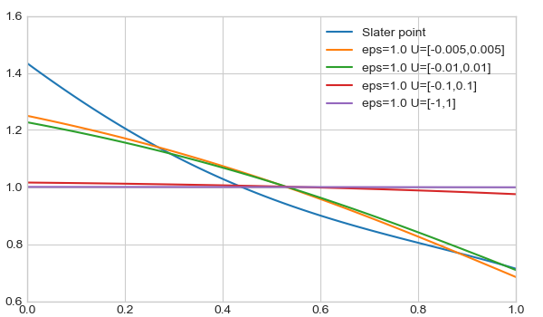
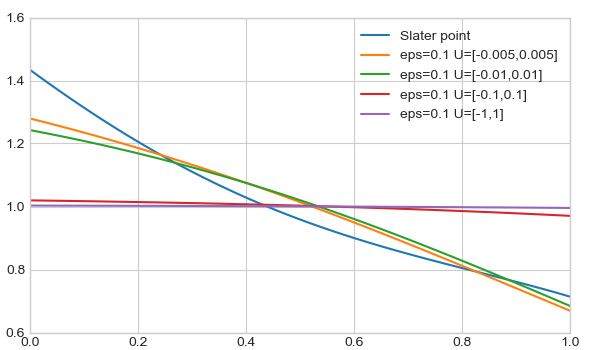
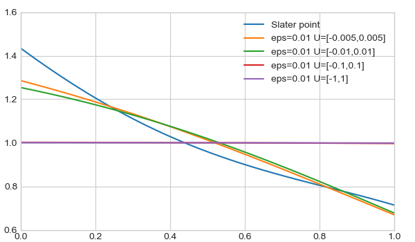
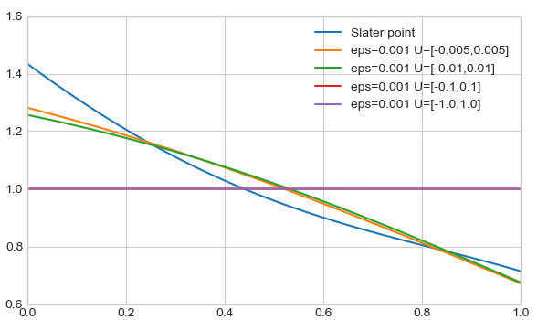

# Review: Generalized maximum entropy estimation 

## code file description
`project.py`: The implementation of Algorithm 1 provided in the paper. Run it directly, and it will produce results of all settings.

`draw.py`: Visualization of produced data.

## some results
- epsilon=1

- epsilon=0.1

- epsilon=0.01

- epsilon=0.001
